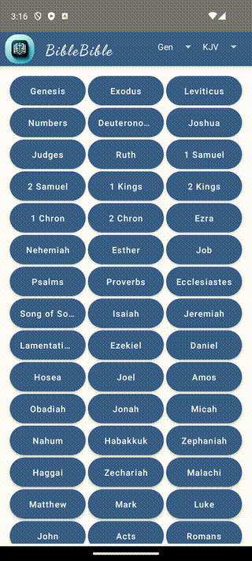

# BibleBible
This is a Bible reading compose multiplatform app that demonstrates the power of Kotlin Multiplatform along with a shared Jetpack Compose UI.

Contributions by Kevin Phillips

## Download
[](https://apps.apple.com/us/app/my-biblebible/id6478799350)

<a href='https://play.google.com/store/apps/details?id=email.kevinphillips.biblebible'>

</a>

## About the App
I am currently prioritizing the development of a minimal viable product (MVP) for this app. This means that the app's core functionality is the primary focus, and I will be adding additional features over time.

To run the app, you will need to provide your own API key from [IQ Bible](https://rapidapi.com/vibrantmiami/api/iq-bible). Once you have your API key, add the key to the file `local.properties` in the root directory of the project:
```
# local.properties
api_key=YOUR_API_KEY_HERE
```

## Approach
To keep things simple and avoid third-party navigation and state management libraries, I have taken a unique approach. Instead of using a traditional navigation library or Koin DI framework, I manage the app's state with a Kotlin object and mimic navigation using animated visibility composables.

## UI and Performance
While developing this app, I have observed some interesting aspects of Compose multiplatform architecture. The styling, including fonts, margins, and spacing, may render slightly differently on iOS compared to Android. Additionally, I've noticed that the performance of the app, while generally smooth, may exhibit some lag, particularly in development builds.

## Future Development
Despite these considerations, I am excited about the potential of this app. As I continue to work on it, I will address these challenges and strive to provide an excellent Bible reading experience for users on both Android and iOS platforms.

* `/composeApp` is for code that will be shared across your Compose Multiplatform applications.
  It contains several subfolders:
  - `commonMain` is for code that’s common for all targets.
  - Other folders are for Kotlin code that will be compiled for only the platform indicated in the folder name.
    For example, if you want to use Apple’s CoreCrypto for the iOS part of your Kotlin app,
    `iosMain` would be the right folder for such calls.

* `/iosApp` contains iOS applications. Even if you’re sharing your UI with Compose Multiplatform, 
  you need this entry point for your iOS app. This is also where you should add SwiftUI code for your project.


Learn more about [Kotlin Multiplatform](https://www.jetbrains.com/help/kotlin-multiplatform-dev/get-started.html)

## Previews
### Android (left) and iOS (right)



## Backlog
*   socket timeout and api/db retries
*   Context Switching: Remember, switching between dispatchers involves context switching, 
*   which can have a slight performance overhead. Minimize unnecessary switching for optimal performance.
*   decouple lazy row chapters from the animatedVisibility of the entire view so when the chapter 
*   is not cached and the remote call fails, the lazy row chapters are not visible
*   add a compiler flag to disable GC on iOS release build
*   other production build considerations for KMM release
*   style UI
*   control size of BookMenu() drop down menu and fix spacing of toolbar menus
*   crashlytics with touchlab CrashKiOS and kermit
*   back handler
*   read JSON files with library
*   remove material library in favor of material3
*   background color on ScrollableTabRow material3
*   add shimmer effect to scripture load
*   merge socket timeout branch, revisit snackbar functionality
*   A-z, OT-NT, sorted comparator
*   API success state
*   UI TESTS
*   mock errors; add Result type to API calls
*   use immutable state with compose
*   Fix bible book abbreviation on home screen, change sort order
*   handle empty list and 200 error response from Rapid API
*   when bibleVersion changes, does a call to Chapter count need to be made
*   review duplicate API call on launch effect
*   supervisorScope coroutine exception handling 
*   If on the same chapter, swiping to the next chapter, do not scroll to the top 
*   Scroll bar on the right 
*   ~~No light mode only dark mode~~
*   ~~sort Books A-Z, disable selectedBook on homeScreen~~
*   ~~add strikethrough backlog~~
*   open/close database

## Nice to have
*   add some UI home screen uniform design
*   only need to query database by newly created databaseKey
*   obfuscation, R8, Proguard
*   log api call stats, analytics
*   refactor database object model
*   review HTML, JSON, Text api queries
*   pinch to zoom scriptures
*   increase font size dynamically
*   Fill white space in the book of Psalms
*   pinch to zoom font size

## Checklist
*   Database retention limit
*   review non null assertion operators
*   review launched effect key
*   review lazy column key
*   review Napier logging for Debug vs. Prod builds
*   internal functions to reduce compile size on iOS from kotlin shared module
*   remove logging and delay() debugging lines
*   database retention
*   review light vs. dark mode
*   cut release branch
*   set functions to internal modifier
*   review logs